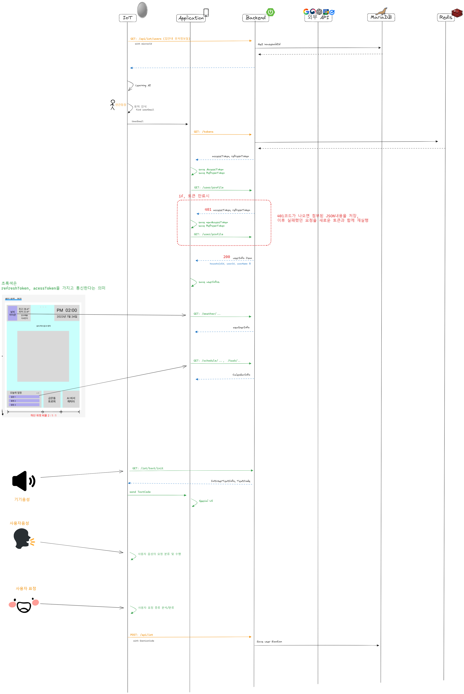
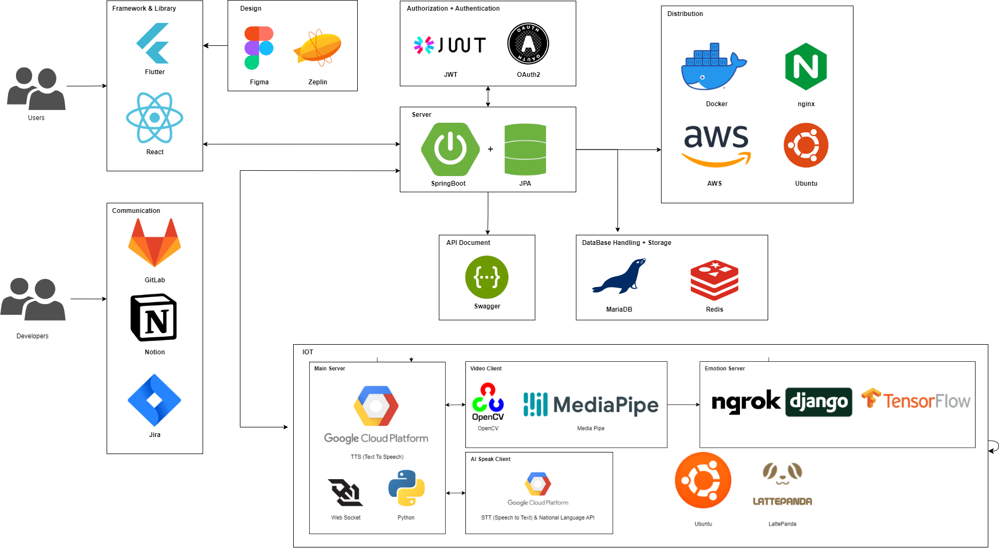

# 🙌 1OT - MLM(Mirror me)
MLM 프로젝트는 가족간 소통 촉진을 위한 가정용 SmartMirror프로젝트예요!
해당 Respository는 MLM-Backend전용 레포지토리입니다.

## 😎 MLM의 Mirror/Application는 이런 일을 해요!
### Application
- Application에서 GoogleOAuth로 로그인을 진행합니다.
- 사용자는 간단히 자신의 프로필(사진포함)/집안 정보를 기입하고, SmartMirror의 QR을 인식합니다. (프로필 사진은 IOT서버 내의 openCV로 학습되어 FaceID가 생성됩니다.)
- 이후 사용자가 Application 로그인시 다음과 같은 페이지를 조회할 수 있습니다.

***- Application 내의 페이지 목록***
1. 가정 위치 기반 날씨 정보 & 개인 일정 조회 페이지
2. SmartMirror에서 촬영된 영상비디오 조회/저장 페이지
3. 그래프를 통한 데일리 감정 기록 조회 페이지
4. 연락 횟수에 대한 가족 마음 온도 조회 페이지

### Mirror
- 사용자가 나타나면 Application정보로 만들어진 faceID를 통해 사용자를 인식합니다
- 해당 사용자의 가정에 대한 날씨정보를 Mirror의 UI로 출력합니다.
- 해당 사용자에게 맞춤형 인사, 비서 음성을 출력합니다.
    - ✔ *감정 기반, 전 날에 화나거나 슬픈 감정이 있는 구성원에 대한 정보 알림* 
    - ✔ *가족 이벤트(생일과 같은) 존재시 해당 구성원의 일정기반 선물 추천 알림*
    - ✔ *Google Calendar내의 일정들을 요약한 3줄 정리 알림*
    - ✔* 수신된 영상비디오에 대하여 조회 권유 알림*
- 사용자의 음성 요청시 해당 요구사항을 수행합니다.
    - ✔ *사용자의 유투브 영상 출력 요구시 수행*
    - ✔ *사용자의 영상메시지 촬영 요구시 수행*

## 👀동작과정 시퀀스 다이어그램이에요!
   

## 🙋‍♀️ MLM-Backend 기술스택이에요!
  

## 🛠 기능 엿보기   

## ✔사용한 툴, 언어 버전정보
| ToolName| Version |
| --- | --- |
| Java | 11 |
| SpringBoot(Gradle) | 2.7.13 |
| MariaDB | 10.11 |
| Redis | 7.0 |
| IntelliJ | 2019.3.5, 2023.1.3 |
| Docker| 24.0.4 |

## ✔ DB스키마
   

